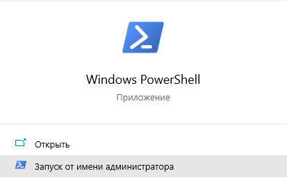
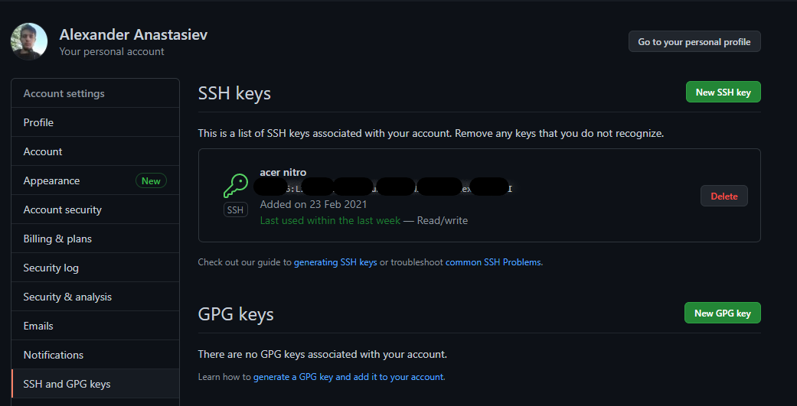
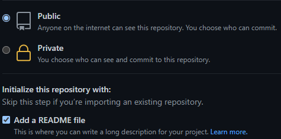
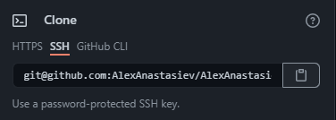
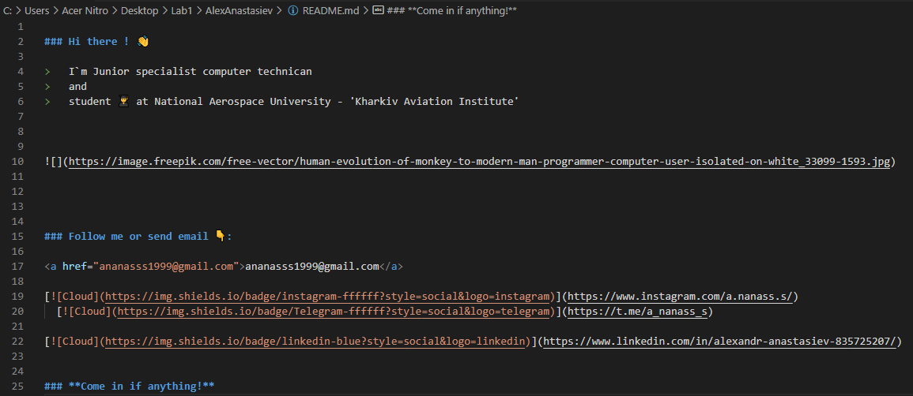

МІНІСТЕРСТВО ОСВІТИ І НАУКИ УКРАЇНИ

Національний аерокосмічний університет ім. М. Є. Жуковського «Харківський авіаційний інститут»

Факультет «Радіоелектроніки, комп’ютерних систем та інфокомунікацій» Кафедра «Аерокосмічних радіоелектронних систем»  

**Лабораторна робота №1**

з дисципліни «Інформаційно-комунікаційні мережі » 

на тему: «Основи роботи з Git»

Виконав: студент 4 курсу 

групи  536ст 

спеціальності 172 «Телекомунікації та радіотехніка»  

Анастасьєв О.А

Прийняв: ас. каф. 501  

Перетятько М. С.  

Національна шкала:  

Кількість балів:  

Оцінка: ECTS  

Харків 2021

Ціль роботи**:** Навчитися створювати репозиторії на GitHub, працювати з ssh ключами, оформляти профіль.

Хід роботи:

1) Створив обліковий запис GitHub:

Рисунок 1 – Профіль на GitHub

Посилання: <https://github.com/AlexAnastasiev>

1) Встановив Chocolatey:

Запустив powershell від імені адміністратора та виконав команду

Рисунок 2 – Windows PowerShell

Set-ExecutionPolicy Bypass -Scope Process -Force; [System.Net.ServicePointManager]::SecurityProtocol = [System.Net.ServicePointManager]::SecurityProtocol -bor 3072; iex ((New-Object System.Net.WebClient).DownloadString('https://chocolatey.org/install.ps1'))

1) Встановив git на комп'ютер за допомогою Chocolatey:

Командою choco install git -y

Рисунок 3 – Встановлений Git 

1) Налаштував git:

git config --global user.name "Alex Anastasiev"

git config --global user.email ananasss1999@gmail.com

1) Створив новий SSH ключ:

ssh-keygen -t ed25519 -C " ananasss1999@gmail.com "

1) Додав ключ до облікового запису Github:

Рисунок 4 – Доданий SSH ключ до GitHub

1) Виставив потрібні налаштування і створив новий репозиторій в GitHub

Рисунок 5 – Новий репозиторій в GitHub

1) Забрав копію на локальний ПК

Рисунок 6 – Копіювання посилання

Для клонування репозиторію використав команду:

git clone git@github.com:AlexAnastasiev/AlexAnastasiev.git

1) Налаштував опис свого профілю

Рисунок 6 – Опис головної сторінки профілю

1) Завантажив файли за допомогою команд:

git add .

git commit -m "Коментар"

git push

ВИСНОВОК

В данній лабораторній роботі було виконано дії по роботі з Git, а саме:

1) Створили обліковий запис у GitHub;
1) Встановили Chocolatey та Git, налаштували його (також встановили ConEmu);
1) Згенерували ключ SSH, та створили репозиторій. Скопіювали його на ПК. Відредагували профіль і завантижили його на GitHub.

