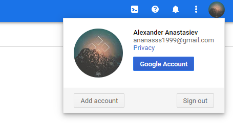
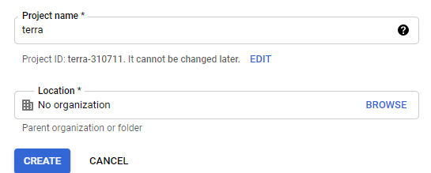
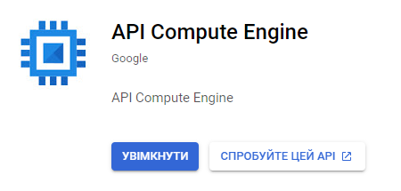
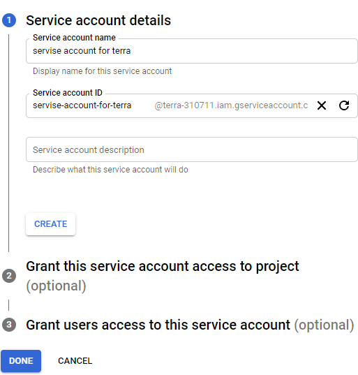
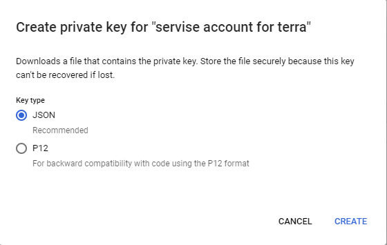
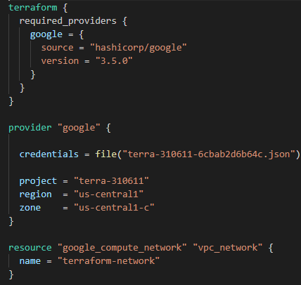
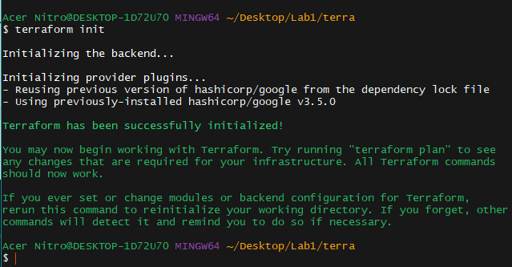
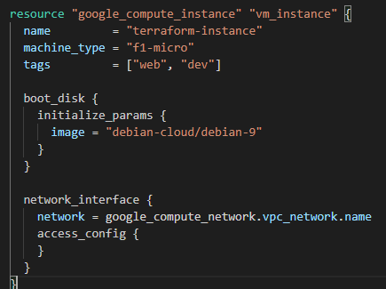
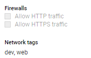

МІНІСТЕРСТВО ОСВІТИ І НАУКИ УКРАЇНИ

Національний аерокосмічний університет ім. М. Є. Жуковського «Харківський авіаційний інститут»

Факультет «Радіоелектроніки, комп’ютерних систем та інфокомунікацій» Кафедра «Аерокосмічних радіоелектронних систем»  

**Лабораторна робота №2**

з дисципліни «Інформаційно-комунікаційні мережі » 

на тему: «Інфраструктура як код»

Виконав: студент 4 курсу 

групи  536ст 

спеціальності 172 «Телекомунікації та радіотехніка»  

Анастасьєв О.А

Прийняв: ас. каф. 501  

Перетятько М. С.  

Національна шкала:  

Кількість балів:  

Оцінка: ECTS  

Харків 2021

Мета роботи**:** Навчитися керувати інфраструктурою за допомогою Terraform

Хід роботи:

1) Створення облікового запису в GCP

Перейшов по посиланню: <https://cloud.google.com/> та зареєстрував обліковий запис у Google Cloud Platform.

Рисунок 1 – Профіль на GCP

1) Встановлення Terraform

Відкрив консоль Git Bash, та за допомогою команди встановивив Terrafom на локальний ПК: 

choco install terraform

terraform –v   – Відображає встановлену версію.

Рисунок 2 – Встановлений Terraform 

1) Побудова інфраструктури 

Створив проект та ввімкнув Google Compute Engine, для проекту.

Рисунок 3 – Створення проекту

Рисунок 4 – Увімкнення Compute Engine 

Також зробив сервіс аккаунт, призначив йому роль “Editor”.

Рисунок 5 – Новий сервіс аккаунт

Рисунок 6 – Новий ключ для сервісного аккаунту

1) Конфігурація Terraform

Зробив новий каталог та перейшов до нього, там створив файл та відкрив його. 

mkdir – створити новий каталог;

сd !$ – перейти до новостворенного каталогу;

touch – створити файл;

start – виконує файл.

Рисунок 7 – Відкритий файл в VS Code

1) Ініціалізація нової конфігурації та створення ресурсів

Ініціалізував конфігурацію командою: terraform init;

Створив ресурси командою: terraform apply.

Рисунок 8 – Ініціалізація конфігурації

1) Зміна інфраструктури

Додав ресурси, змінивши файл конфігурації, додав теги. Виконав команду: terraform apply. 

Рисунок 9 – Додані ресурси

Рисунок 10 – Створений ресурс в GCP

Рисунок 11 – Додані теги до ресурсу

Змінив операційну систему віртуальної машини  в файлі конфігурацій.  

Рядок: image = "debian-cloud/debian-9" замінив на рядок: image = "cos-cloud/cos-stable"

1) Знищення інфраструктури

Виконав знищення інфраструктури командою: terraform destroy

Рисунок 12 – Виконане знищення ресурсу

1) Створив новий репозиторій на GitHub та додав каталог з лабораторними:

https://github.com/AlexAnastasiev/Labs

ВИСНОВОК

В данній лабораторній роботі було виконано дії по роботі з інфраструктурою в Terraform, створили обліковий запис у GСP; Створили проект, сервіс аккаунт та ключ доступу. Встановили Terraform, виконали його конфігурацію; Виконали маніпуляції з інфраструктурою; Зробили репозиторій; Скопіювали його на ПК; Завантажили файли лабораторних робіт в GitHub.

