МІНІСТЕРСТВО ОСВІТИ І НАУКИ УКРАЇНИ

Національний аерокосмічний університет ім. М. Є. Жуковського «Харківський авіаційний інститут»

Факультет «Радіоелектроніки, комп’ютерних систем та інфокомунікацій» Кафедра «Аерокосмічних радіоелектронних систем»

Лабораторна робота №3

з дисципліни «Інформаційно-комунікаційні мережі »

на тему: «Створення віртуальної машини з ОС Debian GNU/Linux»

Виконав: студент 4 курсу 

групи  536ст 

спеціальності 172 «Телекомунікації та радіотехніка»  

Анастасьєв О.А

Прийняв: ас. каф. 501  

Перетятько М. С.  

Національна шкала:  

Кількість балів:  

Оцінка: ECTS  

Харків 2021

Мета роботи**:** Створити віртуальну машину з ОС Debian GNU/Linux. Створити  VPC мережу. Розгорнути інструмент для безперервної інтеграції, доставки та розгортання коду.

Хід роботи:

1) Створив VPC: GPC > Navigation menu > VPC network > Create vpc network.

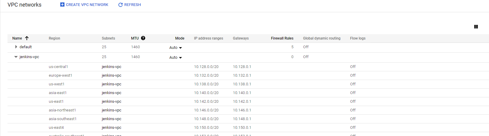

Рисунок 1 – Новостворена VPC

Одразу змінив налаштування фаерволу: ввімкнув тригер “tcp”, та додав порт :8080. 

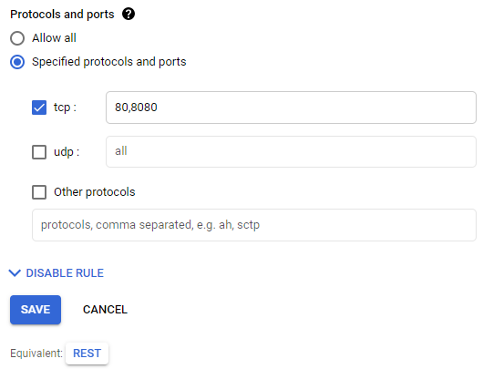

Рисунок 2 – Додавання порту

1) Cтворив нову віртуальну машину с ОС Debian GNU/Linux 10. 

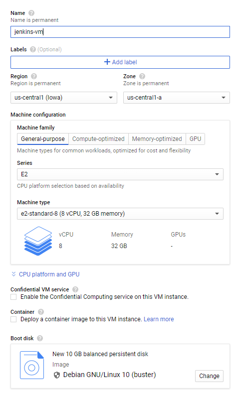

Рисунок 3 – Створення нової віртуальної машини

1) Обрав потрібні налаштування та сервісний обліковий запис. 

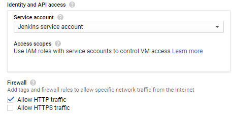

Рисунок 4 – Налаштування VM

1) Вибрали створену VPC мережу.

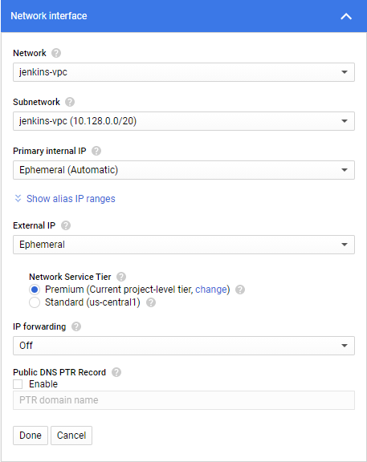

Рисунок 5 – Налаштування мережі для VM 

1) Запустив VM: Navigation menu > Compute Engine > VM instance > “SSH”.

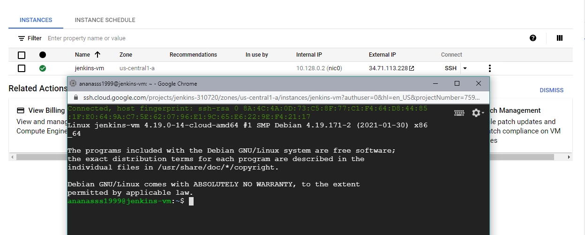

Рисунок 6 – Відкрита VM у вікні браузера

1) Розгорнув інструмент для безперервної інтеграції, доставки та розгортання коду.

Виконав команди :

~$ sudo apt install – встановка пакету;

~$ sudo apt update – оновлення репозиторію;

~$ sudo apt search openjdk – пошук доступних версій Java;

~$ sudo apt install openjdk-11-jdk – встановлення вибраної версії;

~$ sudo apt update ;

~$ java -version ;

~$ sudo apt install wget – встановлення менеджеру завантажень;

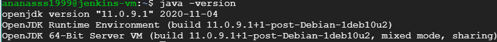

Рисунок 7 – Перевірка версії Java

Додав ключ репозиторію в систему та адресу репозиторію пакетів Debian в source.list серверу:

~$ wget -q -O - https://pkg.jenkins.io/debian/jenkins.io.key | sudo apt-key add - 

~$ sudo sh -c 'echo deb http://pkg.jenkins.io/debian-stable binary/ > /etc/apt/sources.list.d/jenkins.list' 

~$ sudo apt update 

1) Встановив Jenkins:

~$ sudo apt install jenkins

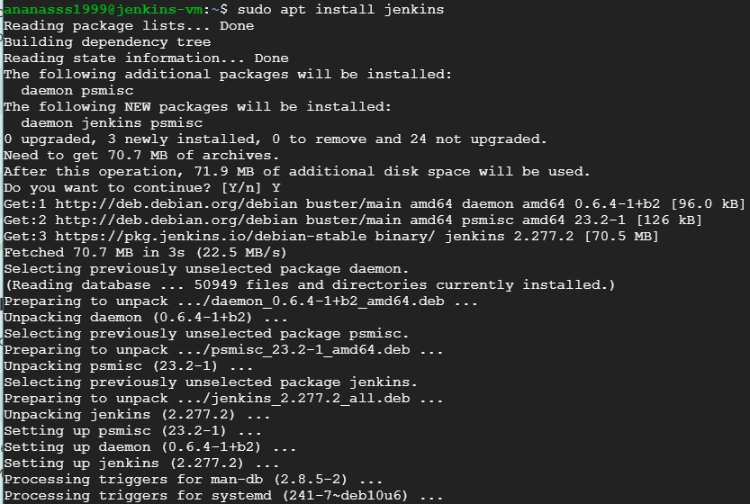

Рисунок 8 – Встановлення Jenkins

1) Запустив Jenkins та перевірив статус:

~$ sudo systemctl start jenkins 

~$ sudo systemctl status jenkins 

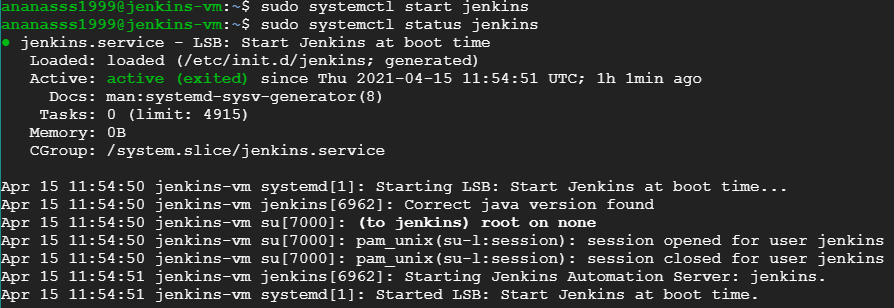

Рисунок 9 – Запуск Jenkins

Щоб налаштувати установку, відкрив Jenkins на використовуваному за замовчуванням порті 8080, використовуючи о IP-адресу:

` `<http://34.66.28.246:8080/>. 

1) Ввів команду для виведення паролю: 

~$ sudo cat /var/lib/jenkins/secrets/initialAdminPassword

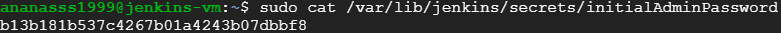

Рисунок 10 – Згенерований пароль

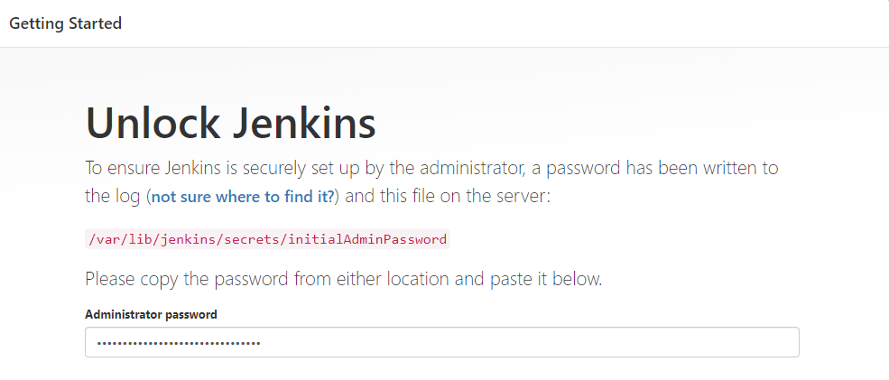

Рисунок 11 – Вікно розблокування

1) Для налаштування Jenkins потрібно встановити плагіни. Вибрав Install suggested plugins (рекомендовані).

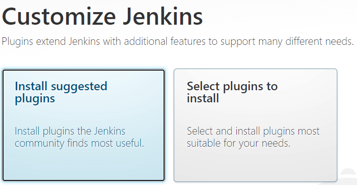

Рисунок 12 – Вибір методу встановлення плагінів

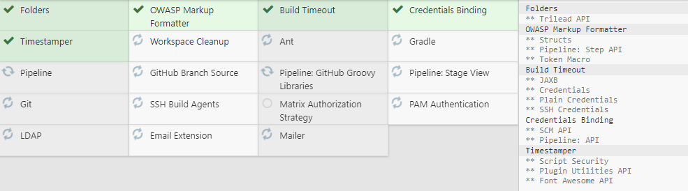

Рисунок 13 – Встановлення плагінів

1) Створив обліковий запис адміністратора.

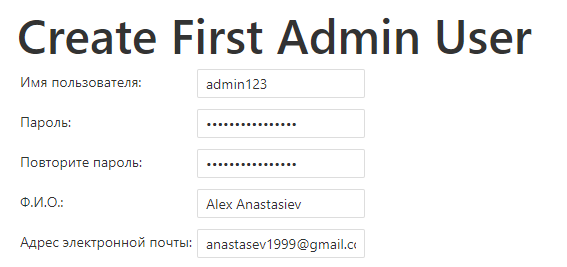

Рисунок 14 – Створення облікового запису

1) Натиснув Start using Jenkins (почати використання Jenkins), щоб відкрити панель управління Jenkins.

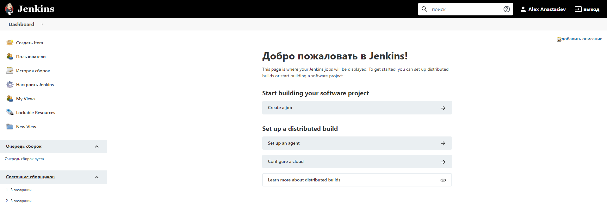

Рисунок 15 – Панель Jenkins 

1) Додав звіт з виконаної лабораторної роботи на GitHub:

<https://github.com/AlexAnastasiev?tab=repositories>

ВИСНОВОК

В данній лабораторній роботі було виконано дії по створенню віртуальної машини, на ОС Debian GNU/Linux 10  у GСP. Створено VPC; Налаштовано VM та мережу; Розгорнуто інструмент для безперервної інтеграції, доставки та розгортання коду. Встановлено Jenkins за допомогою пакетів, запущено сервер, і створено користувача з правами адміністратора. 

