
## Мета роботи**:** Створити віртуальну машину з ОС Debian GNU/Linux. Створити  VPC мережу. Розгорнути інструмент для безперервної інтеграції, доставки та розгортання коду. Створити завдання для відображення тексту з git репозиторія, яке буде виконуватися при зміні файлів у цьому репозиторії (після виконання команди git push).

Хід роботи:

# 1) Створив VPC: GPC > Navigation menu > VPC network > Create vpc network.

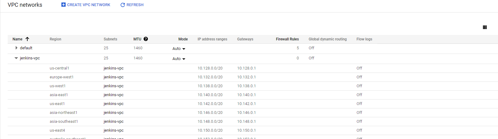

Рисунок 1 – Новостворена VPC

Одразу змінив налаштування фаерволу: ввімкнув тригер “tcp”, та додав порт :8080. 

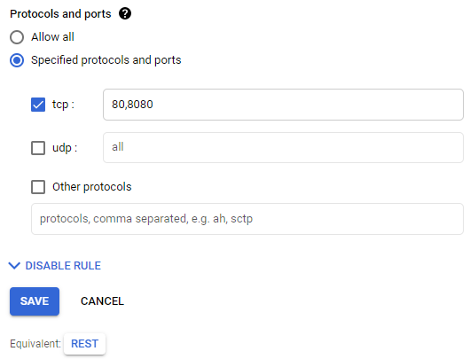

Рисунок 2 – Додавання порту

# 2) Cтворив нову віртуальну машину с ОС Debian GNU/Linux 10. 

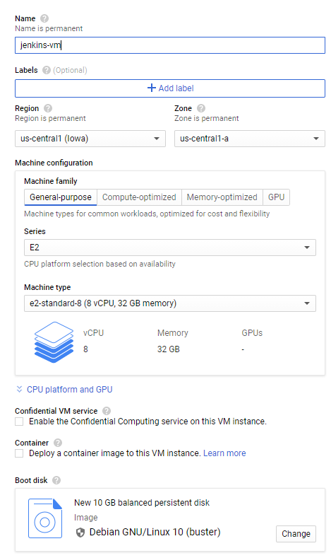

Рисунок 3 – Створення нової віртуальної машини

# 3) Обрав потрібні налаштування та сервісний обліковий запис. 

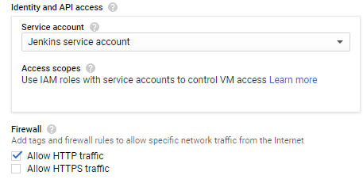

Рисунок 4 – Налаштування VM

# 4) Вибрали створену VPC мережу.

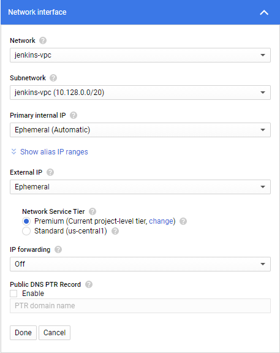

Рисунок 5 – Налаштування мережі для VM

# 5) Запустив VM: Navigation menu > Compute Engine > VM instance > “SSH”.

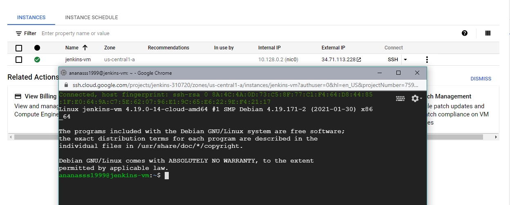

Рисунок 6 – Відкрита VM у вікні браузера

# 6) Розгорнув інструмент для безперервної інтеграції, доставки та розгортання коду.

Виконав команди :

~$ sudo apt install – встановка пакету; 

~$ sudo apt update – оновлення репозиторію;

~$ sudo apt search openjdk – пошук доступних версій Java;

~$ sudo apt install openjdk-11-jdk – встановлення вибраної версії;

~$ sudo apt update ;

~$ java -version ;

~$ sudo apt install wget – встановлення менеджеру завантажень;

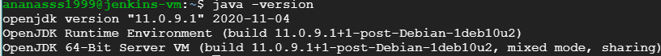

Рисунок 7 – Перевірка версії Java

# 7) Додав ключ репозиторію в систему та адресу репозиторію пакетів Debian в source.list серверу:

~$ wget -q -O - https://pkg.jenkins.io/debian/jenkins.io.key | sudo apt-key add - 

~$ sudo sh -c 'echo deb http://pkg.jenkins.io/debian-stable binary/ > /etc/apt/sources.list.d/jenkins.list' 

~$ sudo apt update 

# 8) Встановив Jenkins:

~$ sudo apt install jenkins

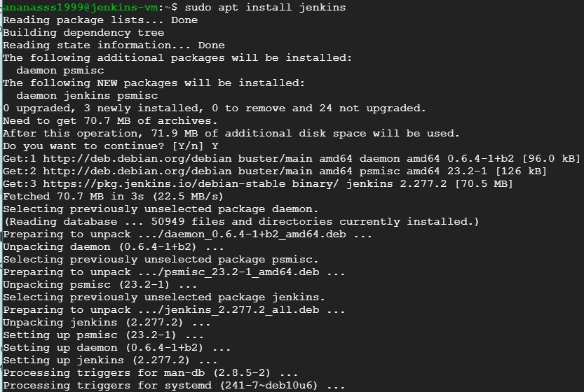

Рисунок 8 – Встановлення Jenkins

# 9) Запустив Jenkins та перевірив статус:

~$ sudo systemctl start jenkins 

~$ sudo systemctl status jenkins 

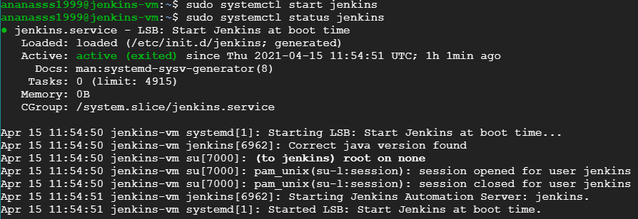

Рисунок 9 – Запуск Jenkins

Щоб налаштувати установку, відкрив Jenkins на використовуваному за замовчуванням порті 8080, використовуючи IP-адресу:

<http://35.225.194.197:8080//>. 

# 10) Ввів команду для виведення паролю: 

~$ sudo cat /var/lib/jenkins/secrets/initialAdminPassword

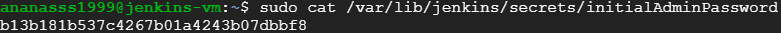

Рисунок 10 – Згенерований пароль

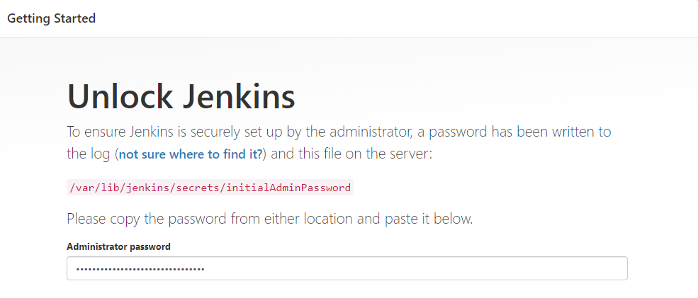

Рисунок 11 – Вікно розблокування

# 11) Для налаштування Jenkins потрібно встановити плагіни. Вибрав Install suggested plugins (рекомендовані).

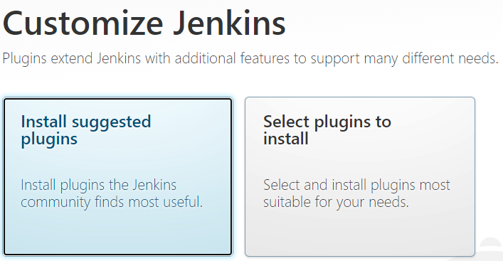

Рисунок 12 – Вибір методу встановлення плагінів

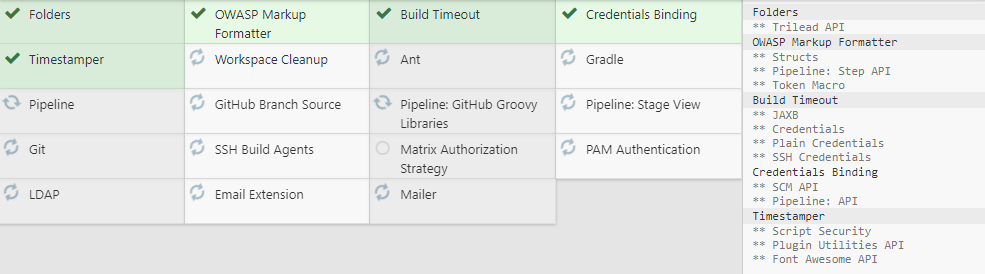

Рисунок 13 – Встановлення плагінів

# 12) Створив обліковий запис адміністратора.

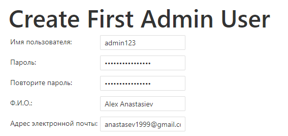

Рисунок 14 – Створення облікового запису

# 13) Натиснув Start using Jenkins (почати використання Jenkins), щоб відкрити панель управління Jenkins.

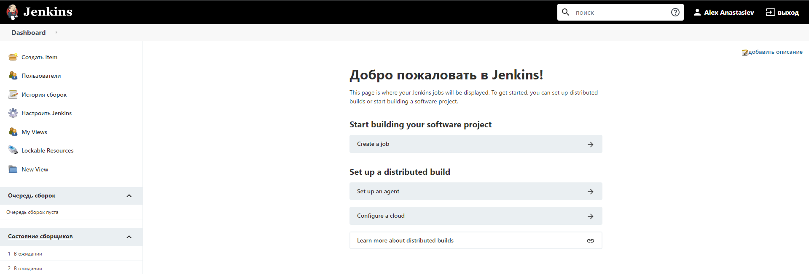

Рисунок 15 – Панель Jenkins

Для того щоб створити проект в Jenkins виконав такі дії:

# 14) Створив новий репозиторій в GitHub; > Скопіював її на ПК, та додав туди файл index.html; > Додав файл на GitHub;

# 15) У панелі управління Jenkins створив нову задачу;

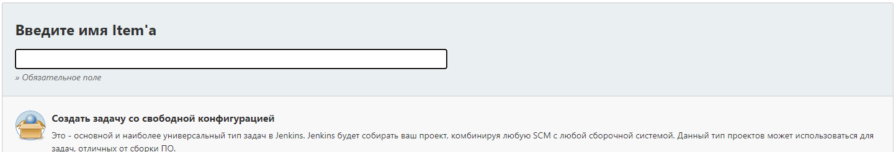

Рисунок 16 – Створення задачі

# 16) Налаштував задачу, вказавши URL-Repository. Та вказав специфікатор гілки \*/main ;

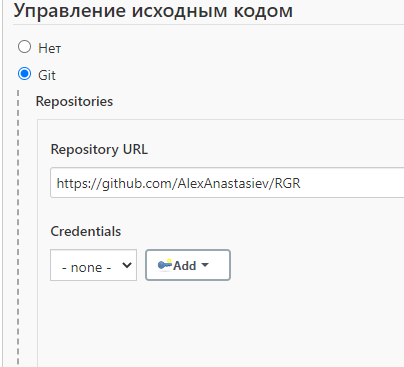 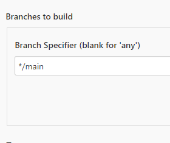

Рисунок 17 – Налаштування задачі

# 17) Додав додатково виконання команди shell, для більш наочної демонстрації результату (в консолі):

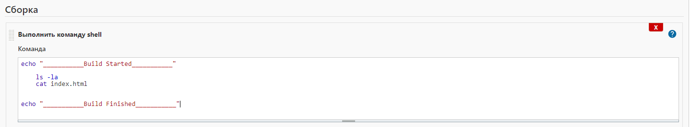

Рисунок 19 – Команда shell

Також увімкнув тригери:

- GitHub project;
- GitHub hook trigger for GITScm polling;
- Add timestamps to the Console Output.

# 18) Запустив задачу на виконання, натиснувши на кнопку «Собрать сейчас»;

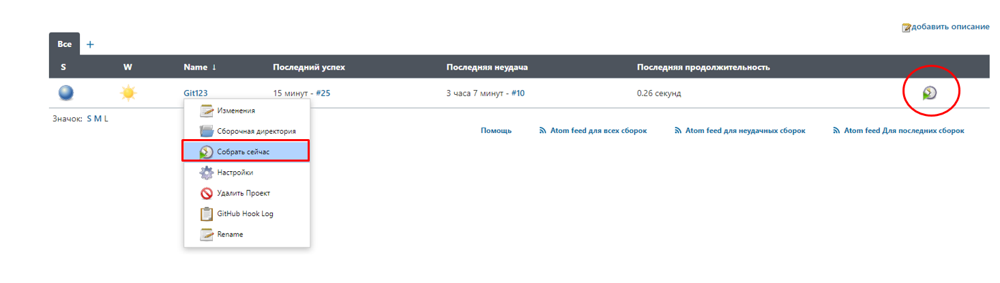

Рисунок 18 – Панель задач

Результат виконання виводиться до вікна консолі, а скопійовані файли з GitHub зберігаються в «Сборочная директория» ;

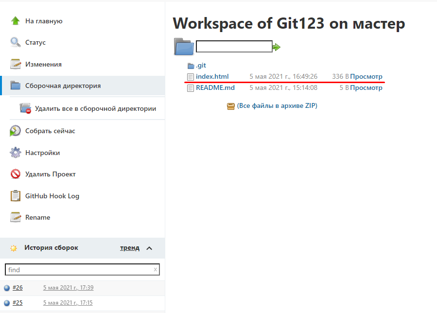

Рисунок 20 – Скопійовані файли репозиторію з GitHub

# 19) Додав вебхук до GitHub.

Для цього виконав такі дії:

Репозиторій > Settings > Webhooks > Add webhook.

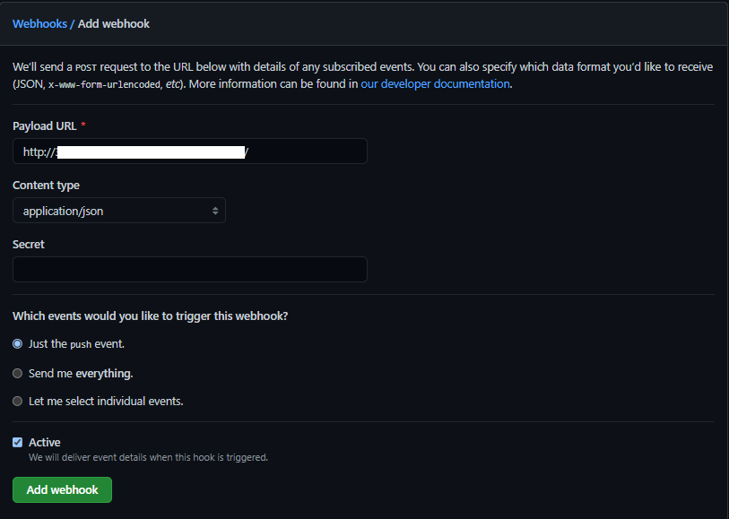

Рисунок 21 – Додавання вебхуку

# 20) Тепер після зміни файлів у репозиторії, та додавання їх в GitHub, Задача в Jenkins буде виконуватися автоматично (після push).

- git add .
- git commit – m “c”
- git push

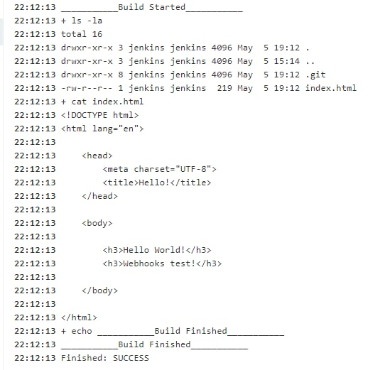

Рисунок 22 – Результат виведений в консоль

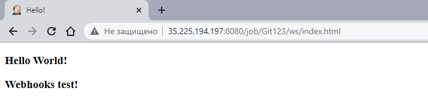

Рисунок 23 – Відображена html сторінка

# ВИСНОВОК 

В данній роботі було виконано дії по створенню віртуальної машини, на ОС Debian GNU/Linux 10  у GСP. Створено VPC; Налаштовано VM та мережу; Розгорнуто інструмент для безперервної інтеграції, доставки та розгортання коду. Встановлено Jenkins за допомогою пакетів, запущено сервер, і створено користувача з правами адміністратора. Після цих дій було створено задачу на відображення файлів з репозиторію GitHub, після виконання команди git push.

